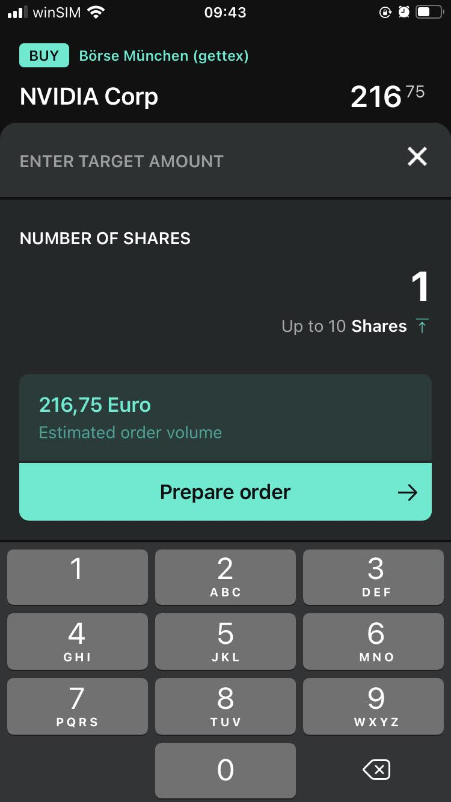

<meta name="og:image" content="https://masaaldosey.github.io/files/investing/IMG_7605.jpg">
<meta property="og:title" content="How I started investing at the age of 26">
<meta property="og:description" content="Overview of broker partner, first trade and current portfolio">

I am 26 years of age and working full-time since October last year. Back in November 2021, I was speaking with my friend
Gaurav. During the conversation, we started discussing about finances and investing opportunities. He spoke about his plans 
and the steps he had taken so far. At that moment, something clicked in my brain. Like a button. I also wanted to invest! 
So, I asked him about how to get started. I listened with utmost interest. Two months have passed since. Today, I invest 
monthly and trade a couple times per month on the <a target="_blank" rel="noopener" href="https://www.investopedia.com/terms/s/stockmarket.asp">stock market</a>. 
I had to complete two main steps to start investing:
1. Choose a broker and open a depot
2. Invest! 

## Step 1: Opening an account (*a.k.a.* depot) with a broker

Gaurav mentioned about <a target="_blank" rel="noopener" href="https://de.scalable.capital/en">Scalable Capital</a>. It is an online brokerage firm located in 
<a target="_blank" rel="noopener" href="https://de.wikipedia.org/wiki/M%C3%BCnchen">Munich</a>. I researched about the firm and compared against its competitors  
(like <a target="_blank" rel="noopener" href="https://traderepublic.com/en-de">Trade Republic</a>, <a target="_blank" rel="noopener" href="https://www.degiro.eu/">Degiro</a>, etc.). In the end, I chose Scalable for two main reasons - its automatic tax filing feature and <a target="_blank" rel="noopener" href="https://de.scalable.capital/en/trading-costs">pricing options</a>.

I did the following to open my depot Scalable Capital:

1. I vistited their <a target="_blank" rel="noopener" href="https://de.scalable.capital/en/register">website</a> and followed the instructions. I had to specify an amount which would be transferred to my brokerage account after it opens. I chose this amount to be &euro;25,00. 

2. Later, I went to a <a target="_blank" rel="noopener" href="https://www.deutschepost.de/en/home.html">Deutsche Post</a> filiale with my passport. I showed the code given to me during the previous step and verified my identity.

3. A day later, I got an email from Scalable asking for my visa details. This information was necessary for them to open an account with <a target="_blank" rel="noopener" href="https://www.baaderbank.de/">Baader Bank</a>. My brokerage account's securities would be managed by Baader Bank.

A couple of days passed after I had shared my visa information. I received the depot opening and the &25,00 deposit confirmation from Scalable. The entire
process took 5 working days to complete.

## Step 2: Executing the first trade

It was Decemeber 2021. I had deposited an additional &euro;1000,00 into my brokerage account. I have always been into gaming and like <a target="_blank" rel="noopener" href="https://www.nvidia.com/en-us/">Nvidia's</a> graphics cards. So, I decided to buy a piece of its stock. I fired up <a target="_blank" rel="noopener" href="https://apps.apple.com/us/app/scalable-capital-etf-stocks/id1075561513">Scalable Capital's mobile app</a>.
Searched for Nvidia. Bought one share. And just like that I executed my first trade. A part of me did not believe that it was so simple.

<figure>
    A picture depicting the app UI. Taken on 03 February 2022.
    
</figure>

## Current Portfolio

It has been a month since I executed the first trade. My current portfolio consists of the following individual stocks:
- Nvidia Corporation (<a target="_blank" rel="noopener" href="https://www.google.com/finance/quote/NVDA:NASDAQ">NVDA</a>)
- Advanced Micro Devices Inc.(<a target="_blank" rel="noopener" href="https://www.google.com/finance/quote/AMD:NASDAQ">AMD</a>)
- Fortiss Inc. (<a target="_blank" rel="noopener" href="https://www.google.com/finance/quote/FTS:NYSE">FTS</a>)
- Apple Inc. (<a target="_blank" rel="noopener" href="https://www.google.com/finance/quote/AAPL:NASDAQ">AAPL</a>)
- Schneider Electric SE (<a target="_blank" rel="noopener" href="https://www.google.com/finance/quote/SU:EPA">SU</a>)
- ASML Holding NV (<a target="_blank" rel="noopener" href="https://www.google.com/finance/quote/ASML:AMS">ASML</a>)

I have invested in the iShares Core S&P 500 UCITS (Acc) ETF (<a target="_blank" rel="noopener" href="https://www.google.com/finance/quote/SXR8:FRA">SXR8</a>) and currently have a savings plan (a.k.a. *sparplan*) setup for it. The plan automates buying of the ETF by deducting a specifc amount from my brokerage account on a monthly basis.